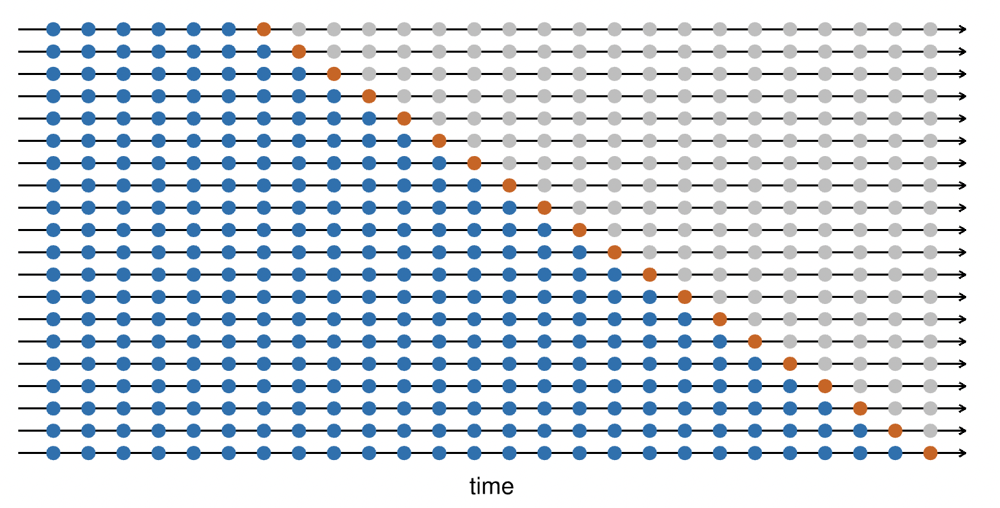

# Time Series Analysis Lecture 3: Autoregressive Models and Moving Average Models
{width=50%}

\newpage

## Class Announcements

- HW 8 and Quiz 8 available

## Roadmap

Last week:

- Regression with time series and smoothing

This Week:

- AR, MA, ARMA, and ARIMA  models and fitting them to data

Next Week:

- More ARMA, ARIMA, and SARIMA models: these will build off the material from this week

\newpage

## Start-up Code
```{r, message=FALSE, error=FALSE, warning=FALSE}
if(!"lubridate"%in%rownames(installed.packages())) {install.packages("lubridate")}
library(lubridate)

if(!"zoo"%in%rownames(installed.packages())) {install.packages("zoo")}
library(zoo)

if(!"fable"%in%rownames(installed.packages())) {install.packages("fable")}
library(fable)

if(!"feasts"%in%rownames(installed.packages())) {install.packages("feasts")}
library(feasts)

if(!"forecast"%in%rownames(installed.packages())) {install.packages("forecast")}
library(forecast)

if(!"tseries"%in%rownames(installed.packages())) {install.packages("tseries")}
library(tseries)

if(!"tsibble"%in%rownames(installed.packages())) {install.packages("tsibble")}
library(tsibble)

if(!"plyr"%in%rownames(installed.packages())) {install.packages("plyr")}
library(plyr)

if(!"dplyr"%in%rownames(installed.packages())) {install.packages("dplyr")}
library(dplyr)

if(!"ggplot2"%in%rownames(installed.packages())) {install.packages("ggplot2")}
library(ggplot2)

if(!"ggthemes"%in%rownames(installed.packages())) {install.packages("ggthemes")}
library(ggthemes)

if(!"scales"%in%rownames(installed.packages())) {install.packages("scales")}
library(scales)
if(!"gridExtra"%in%rownames(installed.packages())) {install.packages("gridExtra")}
library(gridExtra)
```

\newpage

## Autoregressive AR(p) Models

Recall that autoregressive models express a time series' current value as a linear combination of its past values plus random noise:

$$x_t=\mu+\phi_1x_{t-1}+...+\phi_px_{t-p}+\epsilon_t$$
You will notice this looks exactly like a linear regression equation and that is one way people often fit AR(p) models to data!

Other ways are through maximum likelihood, if we assume normally distributed $\epsilon_t$, and Yule Walker equations, which solve for the $\phi_i$ parameters through the autocovariance function across time periods.

We can express AR(p) models using the backshift operator $B^k=x_{t-k}$ by defining $\phi(B)=1-\phi_1B-\phi_2B^2-...-\phi_pB^p$:

$$\phi(B)x_t=\mu+\epsilon_t$$

## Moving Average MA(q) Models

Recall that moving average models express a time series' current value as a linear combination of past random noise terms:

$$x_t=\mu+\epsilon_t+\theta_1\epsilon_{t-1}+...+\theta_q\epsilon_{t-q}$$
We can't estimate this by linear regression since the $\epsilon_t$ values are unknown. We often use maximum likelihood to estimate parameters of a MA model where we assume the $\epsilon_t$ are from a normal distribution.

We can express MA(q) models using the backshift operator $B^k=x_{t-k}$ by defining $\theta(B)=1+\theta_1B+\theta_2B^2+...+\theta_qB^q$:

$$x_t=\mu+\theta(B)\epsilon_t$$
\newpage

## Simulated AR(3) and MA(3) Examples

### AR(3)

Let's simulate a sample AR(3) process to examine its properties:

$$x_t=10+0.7x_{t-1}+0.1x_{t-2}+0.1x_{t-3}+\epsilon_t$$

```{r}
ts1.sim <- 10 + arima.sim(model=list(ar=c(0.7,0.1,0.1)), n=10000)

par(mfrow=c(2,2))
plot(ts1.sim, xlab="t", ylab="Xt", col="cornflowerblue", main="Time Series")
acf(ts1.sim, col="darkorange2", main="ACF")
pacf(ts1.sim, col="gold3", main="PACF")
```

What do you notice from the time series, ACF, and PACF plots?

**The time series plot is centered around a long run mean of 10 and each period oscillates around it with mean reversion.**

**The ACF declines very slowly over time while the PACF plot also shows significance up to three lags, which is the number of terms in the AR process.**

How can we use these to determine the number of lags in an AR model?

**For an AR process, the number of significant terms in the PACF plot can tell us the number of lags $p$ to include.**

\newpage

### MA(3)

Let's also simulate a sample MA(3) process to examine its properties:

$$x_t=10+\epsilon_t+0.7\epsilon_{t-1}+0.1\epsilon_{t-2}+0.1\epsilon_{t-3}$$
(Is this stationary? How do we know?)

**MA processes are always stationary since they are a sum of random noise terms that are themselves stationary.**

```{r}
ts2.sim <- 10 + arima.sim(model=list(order=c(0,0,3), ma=c(0.7,0.1,0.1)), n=10000)

par(mfrow=c(2,2))
plot(ts2.sim, xlab="t", ylab="Xt", col="cornflowerblue", main="Time Series")
acf(ts2.sim, col="darkorange2", main="ACF")
pacf(ts2.sim, col="gold3", main="PACF")
```

What do you notice from the time series, ACF, and PACF plots?

**The time series plot is centered around a long run mean of 10 and each period oscillates around it with mean reversion though the variance/range of the series is smaller than the AR process above.**

**The ACF declines rapidly over time while the PACF plot shows a seasonal pattern with many significant terms.**

How can we use these to determine the number of lags in an MA model?

**The ACF plot will die quickly and have significant terms equal to the number of lags $q$ while the PACF plot will show oscillating behavior with many significant lags.**

### AR(3) and MA(3) Comparison

Let's compare the ACF and PACF plots of the AR(3) and MA(3) processes directly.

```{r}
par(mfrow=c(2,2))
acf(ts1.sim, col="darkorange2", main="AR(3) ACF")
pacf(ts1.sim, col="gold3", main="AR(3) PACF")
acf(ts2.sim, col="darkorange2", main="MA(3) ACF")
pacf(ts2.sim, col="gold3", main="MA(3) PACF")
```

How could you use these to distinguish between an AR and an MA process?

**The ACF plot tells us if it is an AR or MA process quite easily depending on how quickly it dies off. The PACF process can also tell us this based on the shape and whether it dies off quickly or oscillates over time.**

\newpage

## Autoregressive Moving Average ARMA(p,q) Models

ARMA models combine AR and MA models together so that there are both lag time series terms and also lag random noise terms:

$$x_t=\mu+\phi_1x_{t-1}+...+\phi_px_{t-p}+\epsilon_t+\theta_1\epsilon_{t-1}+...+\theta_q\epsilon_{t-q}$$
We need to choose both $p$ the number of AR lags and $q$ the number of MA lags. These models are fit using maximum likelihood.

In terms of the backshift operator $B^k=x_{t-k}$ an ARMA process can be written as:

$$\phi(B)x_t=\mu+\theta(B)\epsilon_t$$

### Simulated AR, MA, ARMA Comparison

```{r}
ts3.sim <- arima.sim(model=list(order=c(4,0,0), ar=rep(0.2,4)), n=10000)
ts4.sim <- arima.sim(model=list(order=c(0,0,4), ma=rep(0.2,4)), n=10000)
ts5.sim <- arima.sim(model=list(order=c(2,0,2), ar=rep(0.2,2), ma=rep(0.2,2)), n=10000)

par(mfrow=c(3,3))
plot(ts3.sim, type = "l", col="orange2", main="AR(4)")
plot(ts4.sim, type = "l", col="orange2", main="MA(4)")
plot(ts5.sim, type = "l", col="orange2", main="ARMA(2,2)")
acf(ts3.sim, col="cornflowerblue", main="AR(4)")
acf(ts4.sim, col="cornflowerblue", main="MA(4)")
acf(ts5.sim, col="cornflowerblue", main="ARMA(2,2)")
pacf(ts3.sim, col="gold3", main="AR(4)")
pacf(ts4.sim, col="gold3", main="MA(4)")
pacf(ts5.sim, col="gold3", main="ARMA(2,2)")
```

How can we distinguish between AR, MA, and ARMA series using these plots?

**The time series plots all look very similar, but the ACF plots show a difference. An AR ACF plot decays very slowly while an MA ACF plot dies quickly. The ARMA model is in between.**

**The same goes for the PACF plot.**

**However, generally speaking it is hard to tell and better to use model selection procedures than solely rely on interpreting plots to determine the model parameters.**

\newpage

## Autoregressive Integrated Moving Average ARIMA(p,d,q) Models

ARIMA models combine AR and MA models together with differencing i.e. taking differences between successive lagged terms in the time series.

There are three parameters to choose for ARIMA models, the number $p$ of AR lags, the number $q$ of MA lags, and the number of differences to take $d$. ARIMA models are essentially ARMA models with differencing to de-trend the series first.

Normally we only use a $d$ of 1 or 2 because more than that leads to overfitting. Furthermore, often we only need 1 or 2 lags to make a time series stationary anyway.

When $d=1$ we have first order differencing to remove a linear trend:

$$y_t^\prime=y_t-y_{t-1}=(1-B)y_t$$
When $d=2$ we have second order differencing to remove a quadratic trend:

$$y_t^{\prime\prime}=(y_t-y_{t-1})-(y_{t-1}-y_{t-2})=1-2y_{t-1}+y_{t-2}=(1-B)^2y_t$$
In general $d$ order differencing using the backshift operator means:

$$y_t^{d\prime}=(1-B)^dy_t$$

We can also express ARIMA(p,d,q) models using the backshift operator $B^k=x_{t-k}$ by defining:

$$\phi(B)(1-B)^dx_t=\mu+\theta(B)\epsilon_t$$

### Simulated ARIMA Examples

```{r}
ts6.sim <- arima.sim(model=list(order=c(1,0,1), ar=rep(0.1,1), ma=rep(0.1,1)), n=10000)
ts7.sim <- arima.sim(model=list(order=c(0,1,0)), n=10000)
ts8.sim <- arima.sim(model=list(order=c(1,1,0), ar=rep(0.1,1)), n=10000)
ts9.sim <- arima.sim(model=list(order=c(0,1,1), ma=rep(0.1,1)), n=10000)

par(mfrow=c(3,4))
plot(ts6.sim, type = "l", col="orange2", main="ARMA(1,1)")
plot(ts7.sim, type = "l", col="orange2", main="ARIMA(0,1,0)")
plot(ts8.sim, type = "l", col="orange2", main="ARIMA(1,1,0)")
plot(ts9.sim, type = "l", col="orange2", main="ARIMA(0,1,1)")
acf(ts6.sim, col="cornflowerblue", main="ARMA(1,1)")
acf(ts7.sim, col="cornflowerblue", main="ARIMA(0,1,0)")
acf(ts8.sim, col="cornflowerblue", main="ARIMA(1,1,0)")
acf(ts9.sim, col="cornflowerblue", main="ARIMA(0,1,1)")
pacf(ts6.sim, col="gold3", main="ARMA(1,1)")
pacf(ts7.sim, col="gold3", main="ARIMA(0,1,0)")
pacf(ts8.sim, col="gold3", main="ARIMA(1,1,0)")
pacf(ts9.sim, col="gold3", main="ARIMA(0,1,1)")
```

How can we distinguish between an ARMA and ARIMA series using these plots?

**ARIMA models will contain a long term trend that we remove through differencing / integration, which means the ACF plot will exhibit the pattern of a long term trend, showing no gradual decline. ARMA models exhibit no such trend in the ACF plot because they are already detrended.**

\newpage

## Checking for Stationarity

There are two main statistical tests for stationarity.

### Augmented Dickey Fuller (ADF) Tests

One common test is the augmented dickey fuller (adf) test. The null hypothesis is that the time series is not stationary while the alternative hypothesis is that the time series is stationary.

The test works as a regression model where we model the one lag difference in $x_t$ as a function of a constant, a linear time trend, and successive autoregressive / lagged differences:

$$\Delta x_t=\alpha+\beta t+\gamma x_{t-1}+\delta_1\Delta x_{t-1}+...+\delta_{p-1}\Delta x_{t-p+1}+\epsilon_t$$
The intuition in the test is that a stationary process has a constant long run mean, so the time series exhibits mean reversion.

High current values imply it is likely that future values in the series will be small (negative impact on $\Delta x_t$) and small current values imply future will be large (positive impact on $\Delta x_t$). Hence $\gamma$ should be negative and statistically significant in a stationary series.

We can therefore use hypothesis tests on the gamma coefficient to measure stationarity.

This makes the null hypothesis $H_0: \gamma=0$ imply the time series is non stationary i.e. explosive, and the alternative hypothesis that the series is stationary is $H_A: \gamma<0$.

One downside to the test is that we need to specify the lag order for the regression model ahead of time, which means we need to estimate it first (R will use a default lag based on the length of the time series object, which is unsatisfactory). The test also has relatively low power.

```{r}
ts.series1 <- arima.sim(model=list(order=c(5,0,0), ar=rep(0.1,5)), n=10000)

ts.series2 <- arima.sim(model=list(order=c(0,1,0)), n=10000)

adf.test(ts.series1, alternative = "stationary", k = 5)

adf.test(ts.series2, alternative = "stationary", k = 5)
```

### Phillips Perron Test

The Phillips Perron Test is similar to the standard Dickey Fuller Test, which is the same as the ADF test above without the lagged autoregressive difference terms:

$$\Delta x_t=\alpha+\beta t+\gamma x_{t-1}+\epsilon_t$$
It still involves a null hypothesis of non stationarity and an alternative hypothesis of stationarity, testing this through the statistical significance and sign on the $\gamma$ coefficient from the regression model.

The difference is the Phillips Perron test analyzes things by correcting the residuals in the regression for autocorrelation, using what are known as Newey West standard errors. The benefit to this test is that you do not need to specify the number of autoregressive lags ahead of time.

However, research suggests this test has worse finite sample power compared to the ADF test, so generally we use the ADF test instead.

```{r}
PP.test(ts.series1)

PP.test(ts.series2)
```

\newpage

## Choosing the Number of Lags: Finding p, d, and q

For the next few sections, let's use a real world data set of the YEN-USD exchange rate for each year from 1990 to 2020. We can get the data from FRED.

We will cover the various ways to select p, d, and q in a time series model.

```{r}
dat<-read.csv("./data/EXJPUS.csv")

dat<-dat %>%
  mutate(Date=as.Date(DATE),
         mnth=yearmonth(Date),
         Var=EXJPUS)

head(dat)
```

```{r}
dat %>%
  ggplot(aes(Date,Var)) +
  geom_line(color="cornflowerblue") +
  theme_economist_white(gray_bg=F) +
  xlab("Date") +
  ylab("")

dat<-dat %>%
  as_tsibble(index=mnth)
```

### Diagnostic Plots

We can use PACF and ACF plots directly to both choose whether the series is more likely to come from an AR, MA, ARMA, or ARIMA model and suggest the parameter values. It is often hard to the exact specifics however.

Which process does the data seem more likely to be coming from? And how many lags might you use?

```{r}
g1<-dat %>%
  ACF(Var, type="correlation") %>%
  autoplot()

g2<-dat %>%
  ACF(Var, type="partial") %>%
  autoplot()

grid.arrange(g1,g2,nrow=1)
```

### AIC

AIC is a model score based on maximum likelihood. It is defined as:

$$AIC=2k-2ln(\hat{L})$$
where $\hat{L}$ is the maximized likelihood function and $k$ is the number of estimated parameters.

A lower AIC is better, so a model with fewer estimated parameters and a larger maximized likelihood function is ideal. We can use AIC to figure out the number of lags, which is the number of parameters, by fitting a bunch of models to the data and then selecting whichever model has the lowest AIC.

```{r}
model.aic<-dat %>%
  model(ARIMA(Var ~ 1 + pdq(1:10,1:2,1:10) + PDQ(0,0,0), ic="aic", stepwise=F, greedy=F))

model.aic %>%
  report()
```

### AICc

AICc is an adjusted version of AIC for small sample sizes that adds an additional penalty on the number on parameters:

$$AICc=AIC+\frac{2k^2+2k}{n-k-1}$$
The penalty goes to zero as $n\rightarrow\infty$, meaning for large data sets with relatively few parameters AICc and AIC are the same.

```{r}
model.aicc<-dat %>%
  model(ARIMA(Var ~ 1 + pdq(1:10,1:2,1:10) + PDQ(0,0,0), ic="aicc", stepwise=F, greedy=F))

model.aicc %>%
  report()
```

### BIC

BIC is a model score based on maximum likelihood. It is defined as:

$$BIC=kln(n)-2ln(\hat{L})$$
where $\hat{L}$ is the maximized likelihood function, $k$ is the number of estimated parameters, and $n$ is the number of data points.

A lower BIC is better, so a model with fewer estimated parameters and a larger maximized likelihood function is ideal. We can use BIC to figure out the number of lags, which is the number of parameters, by fitting a bunch of models to the data and then selecting whichever model has the lowest BIC.

Generally, BIC has a larger penalty for models with more parameters and therefore selects sparser models with fewer parameters compared to AIC and AICc.

```{r}
model.bic<-dat %>%
  model(ARIMA(Var ~ 1 + pdq(1:10,1:2,1:10) + PDQ(0,0,0), ic="bic", stepwise=F, greedy=F))

model.bic %>%
  report()
```

### Cross Validation / Forecast Error

Another way to identify the ideal number of lags is to use time series cross validation where we split our data into various training and test sets and compare model performance across the folds. The challenge here is that we can't randomly split the data due to the time series nature.

Effectively what we do is only use all data prior to an observation to predict it, ensuring we never use the future to predict the past, and keeping our test set to single observations. Each next fold is a successive observation into the future. (We could have our test set be a specified size greater than one if we wanted to.)



Instead of predicting one step ahead and using all prior data up to the test set observation, we can predict n steps ahead and use all data prior to n lags. Depending on how far in the future we care about forecasting, this method may be better.

While conceptually nice, this method suffers from computational complexity and is rarely used unless we are dealing with very sophisticated time series models where closed form solutions to the likelihood are hard to find.

We typically select the model parameters that have the lowest RMSE after cross validation.

```{r}
choose.p <- function(x, h, p) {
  arma.model <- arima(x, order = c(p,1,0), include.mean = T)
  forecast(arma.model, h=h)
}

residual.list<-NULL
max.p<-5
for(i in 1:max.p) {
  residual.list[[i]]<-tsCV(dat$Var, choose.p, h=1, p=i)
  print(i)
}

rmse.results<-sapply(residual.list, function(r) sqrt(mean(r^2, na.rm=T)))

data.frame("p"=as.factor(1:max.p),"rmse"=rmse.results) %>%
  ggplot(aes(p,rmse)) +
  geom_bar(stat="identity",alpha=0.4,fill="cornflowerblue") +
  theme_economist_white(gray_bg=F) +
  xlab("P") +
  ylab("RMSE")
```

```{r}
ar.bic<-dat %>%
  model(ARIMA(Var ~ 1 + pdq(1:5,1,0) + PDQ(0,0,0), ic="bic", stepwise=F, greedy=F))

ar.bic %>%
  report()
```

### The Box Jenkins Method

The Box Jenkins method is a step by step process to fit time series models that involves combining the steps above that we have already seen.

It concludes by running tests on the fitted model residuals to determine whether the model satisfies the necessary assumptions and is a good fit to the data.

The steps in order are:

(1) Determine if it an AR, MA, ARMA, or ARIMA model is appropriate.

(2) Determine the parameters p, d, and q using a combination of ACF, PACF, AIC, BIC, etc.

(3) Fit the model and examine the residuals in plots and use a Ljung Box test for autocorrelation

Since we already did (1) and (2) above, let's use the model selected by AIC to do the last step.

First, let's plot the residuals over time.

Do the residuals seem stationary? Or is there a drift in the mean / non constant variance?

```{r}
model.bic %>%
  augment() %>%
  ACF(.resid) %>%
  autoplot()
```

**The residuals do not appear to be completely white noise. There are some significant lags and also a seasonal pattern that suggests additional terms could be added to the model to improve fit.**

### Ljung Box Test

We can also run a statistical test on the residuals from the model to see if they appear to be randomly distributed i.e. are white noise, which is what we want for a good model fit, or if they appear to have some serial correlation over time and violate the assumptions for a stationary time series fit.

In this test, the hypotheses are:

$$H_0: data\ are\ independently\ distributed$$
$$H_A: data\ are\ not\ independently\ distributed$$
The test statistic is:

$$Q=n(n+2)\Sigma_{k=1}^h\frac{\hat{\rho}_k^2}{n-k}$$
where $n$ is the sample size, $\hat{\rho}_k$ is the sample autocorrelation at lag $k$, and $h$ is the number of lags tested. Under $H_0$ $Q$ asymptotically follows a $\chi^2_h$ distribution.

Sometimes for a complicated time series model, we will want to test for autocorrelation at multiple lags and correct for multiple hypotheses using the Bonferonni correction or similar methods.

Typically, unless you are testing more than 10 lags as a rule of thumb, correcting for multiple hypotheses does not usually change results. We also usually want to check up to around 10 lags in real world data to be confident we have white noise residuals.

```{r}
resid.ts<-model.bic %>%
  augment() %>%
  select(.resid) %>%
  as.ts()

Box.test(resid.ts, lag = 1, type = "Ljung-Box")

Box.test(resid.ts, lag = 10, type = "Ljung-Box")
```

\newpage

## Making Forecasts

Typically, the process we use to make forecasts is to:

(1) Split our data into a training and evaluation / test set.

(2) Optimize our model(s) on the training data while balancing overfitting to arrive at a stationary model using the techniques we saw above

(3) Use the optimized model(s) to make forecasts into the future along with confidence intervals on the evaluation / test set

(4) Judge forecasts using one of various metrics (usually RMSE) to identify the best model and gauge performance

Let's divide our data set into a training and test set and make forecasts on the test set to examine performance based on RMSE for a couple different models.

We can compare the BIC model selected above to an adjusted one based on the resulting ACF plot of the residuals.

```{r}
test.size<-12

dat.train<-dat %>%
  slice(1:(n()-test.size))

model.comp<-dat.train %>%
  model(bic=ARIMA(Var ~ 1 + pdq(3,1,2) + PDQ(0,0,0), ic="aic", stepwise=F, greedy=F),
        adj.bic=ARIMA(Var ~ 1 + pdq(3,1,4) + PDQ(0,0,0), ic="bic", stepwise=F, greedy=F))
model.comp

model.comp %>%
  augment() %>%
  ACF(.resid) %>%
  autoplot()

model.comp %>%
  augment() %>%
  filter(.model=="adj.bic") %>%
  select(.resid) %>%
  as.ts() %>%
  Box.test(., lag = 10, type = "Ljung-Box")

model.forecasts<-forecast(model.comp, h=test.size)

model.forecasts %>%
  autoplot(colour="cornflowerblue") + 
  autolayer(dat, colour="black") + 
  geom_line(data=model.comp %>% augment(), aes(mnth,.fitted,color=.model)) +
  facet_wrap(~.model, ncol=1, nrow=3)

accuracy(model.forecasts, dat)
```

\newpage

## Next Week

- HW 8 (this week's material) is due next week

- Complete week 9 material (lectures + quiz) before next week
